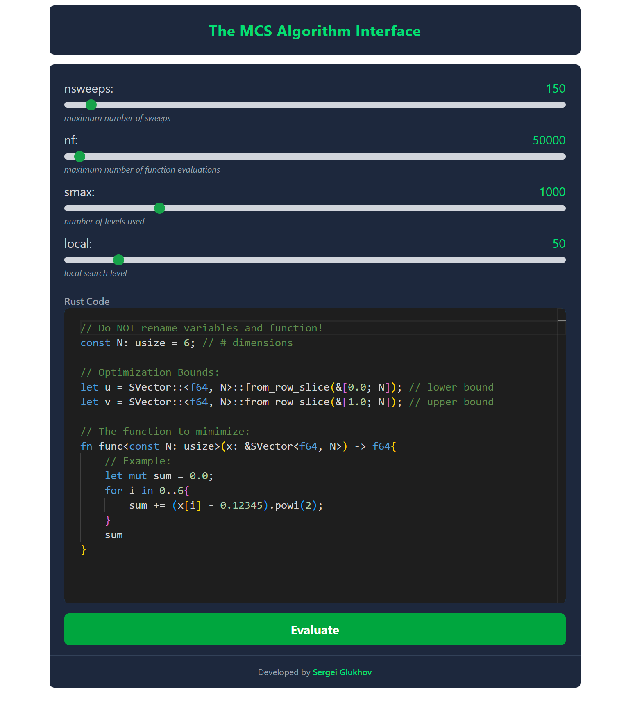

# Rust MCS Web Interface

A modern web interface for the [Rust MCS global minimization algorithm](https://github.com/SergeiGL/Rust_MCS) - a tool for solving complex global
optimization problems.



## Quick Start

### Prerequisites

- [Git](https://git-scm.com/downloads)
- [Docker](https://www.docker.com/products/docker-desktop/)
- [Docker Compose](https://docs.docker.com/compose/install/) (usually included with Docker Desktop)

### Installation and Launch

1. Clone the repository:
   ```bash
   git clone https://github.com/SergeiGL/Rust_MCS_web
   cd Rust_MCS_web
   ```

2. Start the application with Docker Compose:
   ```bash
   docker compose up
   ```

3. Access the interface in your browser:
   ```
   http://localhost:3000
   ```

## Acknowledgments

- Based on the [Rust MCS implementation](https://github.com/SergeiGL/Rust_MCS)
- Original MCS algorithm by Huyer and Neumaier